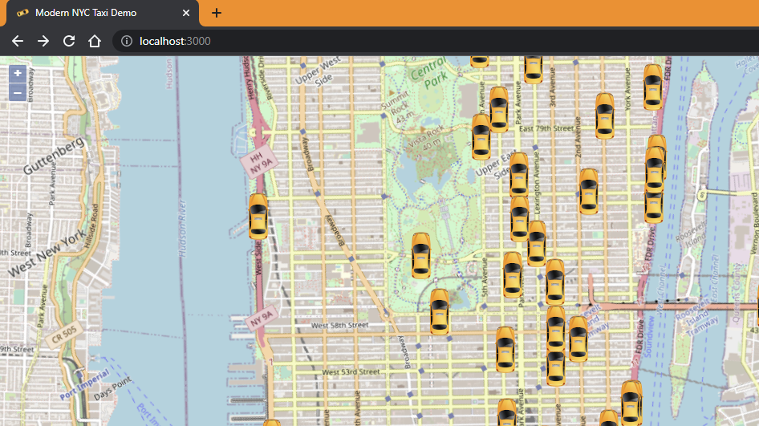

# OpenLayers free map version

This is a partially-completed version of the Solace Taxi NYC demo that uses OpenLayers (https://openlayers.org/) instead of Google Maps.

You can find it running here: https://sg.solace.com/taxi-ol/

## Building / Setup

Start with this: https://openlayers.org/en/latest/doc/tutorials/bundle.html

You're going to need `git` installed, and a newish version of `npm`.

Do:
```
npx create-ol-app map
```

- That will make a starter project in a new folder called `map`.
- Then copy all the files in this folder into that `map` folder (overwrite them).
- Or, better yet, (until I figure out a better way to do this):
```
rm map/index.html
rm map/main.js
ln index.html map
ln main.js map
ln shared.js map
ln favicon.ico map
ln icon.png map
```


Most of the brains of this thing are in the `main.js`.  `shared.js` is where it connects to.


## Running

If you do `npm start` that will start a test dev webserver on port 3000, and you can see the map in action!





## TODO

- taxi icon rotation / scaling / opacity fade-out when done
- ride hailed / started / ended icons
- popup info box

## Build for Dist

if you do `npm run build`, it's supposed to build you a deployable version. Except it misses some included files and the paths are wrong, so I have to figure that out first. The version running at https://sg.solace.com/taxi-ol has had some tweaks made.

